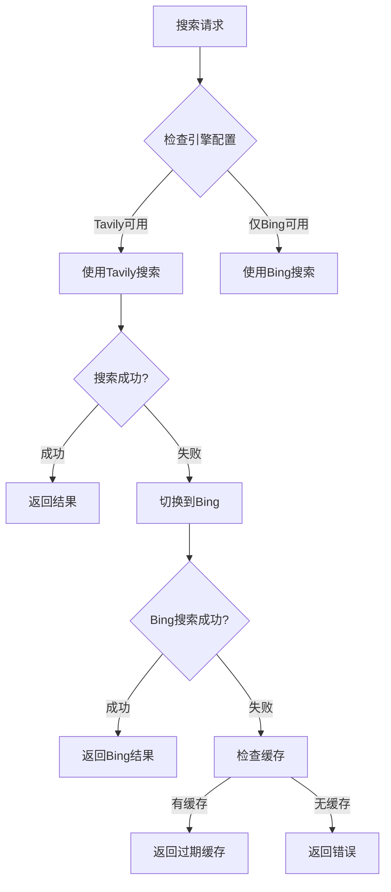

# 网络搜索插件 (Web Search Plugin)

为Nichijou家庭AI管家提供联网搜索功能，支持Tavily和Bing双引擎，智能切换确保搜索成功率。

## 功能特性

- 🔍 **双引擎支持**: Tavily (AI优化) + Bing (官方稳定)
- 🚀 **智能切换**: 主引擎失败时自动切换到备用引擎
- 💾 **智能缓存**: 30分钟缓存，降低API调用成本
- 🌏 **中文优化**: 针对中文搜索结果进行优化
- ⚡ **快速响应**: 10秒超时，支持降级策略
- 🛡️ **错误处理**: 完善的错误处理和友好提示

## 支持的搜索引擎

| 引擎 | 特点 | 免费额度 | 适用场景 |
|------|------|----------|----------|
| **Tavily** | AI优化摘要，为LLM设计 | 1000 credits/月 | 一般问答，信息检索 |
| **Bing** | 微软官方，中文支持好 | 1000次/月 | 中文内容，新闻资讯 |

## 安装配置

### 1. 安装插件

在 `~/.nichijou/config.yaml` 中添加：

```yaml
plugins:
  - "@nichijou/plugin-web-search"
```

### 2. 获取API密钥

#### Tavily API Key (推荐)

1. 访问 [Tavily官网](https://tavily.com)
2. 注册账号并验证邮箱
3. 免费获得 1000 credits/月
4. 复制API Key

#### Bing API Key (备用)

1. 访问 [Azure Portal](https://portal.azure.com)
2. 创建Azure账号（需信用卡验证）
3. 搜索 "Bing Search v7"
4. 创建资源，选择 **F0免费层** (1000次/月)
5. 获取API Key

### 3. 配置密钥

**方法1: 环境变量**
```bash
export TAVILY_API_KEY="tvly-xxxxxxxxxx"
export BING_API_KEY="xxxxxxxxxxxxxxxxxxxxxxxxxxxxxxxx"
```

**方法2: Admin界面配置**
1. 访问 管理页面 → 插件
2. 找到 "网络搜索" 插件
3. 点击设置，填入API Key
4. 保存配置

### 4. 验证配置

重启服务后，询问管家：
```
帮我搜索一下今天的新闻
```

如果配置正确，管家会自动联网搜索并返回结果。

## 配置参数

| 参数 | 类型 | 默认值 | 说明 |
|------|------|--------|------|
| `tavilyApiKey` | string | - | Tavily搜索API密钥 |
| `bingApiKey` | string | - | Bing搜索API密钥 |
| `defaultEngine` | string | "auto" | 默认引擎：auto/tavily/bing |
| `maxResults` | number | 5 | 默认搜索结果数量 (1-20) |
| `enableCache` | boolean | true | 启用搜索结果缓存 |
| `cacheMinutes` | number | 30 | 缓存有效期（分钟） |
| `timeout` | number | 10000 | 搜索超时时间（毫秒） |

## 工具说明

### web_search
主要搜索工具，AI会自动调用。

**参数:**
- `query` (必填): 搜索关键词
- `maxResults` (可选): 结果数量，默认5
- `engine` (可选): 指定引擎 (tavily/bing/auto)

**示例:**
```json
{
  "query": "2024年人工智能发展趋势",
  "maxResults": 8,
  "engine": "tavily"
}
```

### search_engine_status
检查引擎配置状态和缓存统计。

### validate_search_keys
验证API密钥有效性。

## 使用示例

### 基础搜索
**用户:** "今天有什么重要新闻？"
**AI:** 自动调用 `web_search("今日重要新闻")` 并整合结果回答

### 技术查询
**用户:** "React 19有什么新特性？"
**AI:** 自动搜索最新React信息并总结特性

### 实时信息
**用户:** "特斯拉股价今天怎么样？"
**AI:** 搜索实时股价信息并分析

## 引擎切换策略



## 故障排除

### 常见问题

**Q: 提示"API密钥未配置"**
A: 检查环境变量或Admin界面配置，确保至少配置一个引擎的密钥。

**Q: 搜索响应很慢**
A: 检查网络连接，考虑降低 `timeout` 值或启用缓存。

**Q: 中文搜索结果不理想**
A: 建议配置Bing引擎，对中文内容支持更好。

**Q: 达到API配额限制**
A: 配置双引擎以确保服务连续性，或等待配额重置。

### 调试命令

```bash
# 检查引擎状态
curl -X POST http://localhost:3000/api/tools/search_engine_status/execute

# 验证API密钥
curl -X POST http://localhost:3000/api/tools/validate_search_keys/execute

# 测试搜索
curl -X POST http://localhost:3000/api/tools/web_search/execute \
  -H "Content-Type: application/json" \
  -d '{"query": "test search"}'
```

## 性能优化

- 启用缓存减少重复搜索的API调用
- 合理设置 `maxResults` 避免过多结果影响响应速度
- 使用双引擎配置确保服务可用性
- 定期清理过期缓存释放内存

## 安全说明

- API密钥存储在本地配置文件中
- 缓存数据仅存储在内存中，重启后清空
- 不记录用户搜索内容和结果
- 支持通过环境变量安全配置密钥

## 版本信息

- **当前版本**: 0.1.0
- **兼容性**: Nichijou Loop v0.1.0+
- **Node.js**: 22+
- **TypeScript**: 5+

## 许可证

本插件遵循项目主许可证。